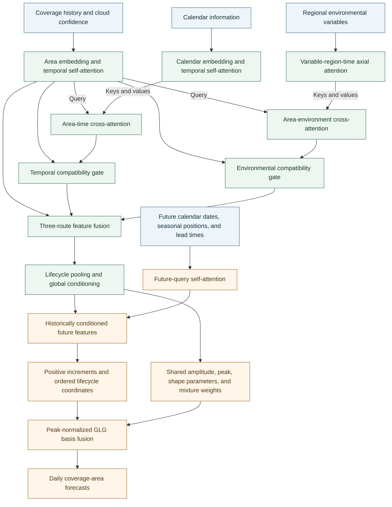

# STV-GLGFormer

STV-GLGFormer is a Transformer framework for dynamically updated forecasts of basin-wide daily *Ulva prolifera* coverage area. It combines area-centered spatiotemporal-variable encoding, a structured Gaussian-Logistic-Gompertz lifecycle decoder, and progressive-prefix residual optimization.

## Architecture



## Method

### Area-Centered STV Encoding

Coverage history, calendar information, and regional environmental variables are encoded through separate pathways. The environmental branch applies attention across variables, regions, and time, preserving their distinct roles in bloom development. Coverage features act as queries in two cross-attention pathways that retrieve temporal and regional environmental information. Compatibility gates regulate the retrieved information before three-route fusion constructs the historical representation.

### GLG Lifecycle Decoding

Lifecycle attention pooling and the final encoded historical state form a shared global condition. Future-date queries combine calendar information, seasonal position, and forecast lead time. Their historically conditioned features determine positive lifecycle increments, which are cumulatively normalized to preserve date order.

The decoder combines peak-normalized Gaussian, Logistic-derivative, and Gompertz-derivative bases:

$$
\widehat{y}_m=A_{\mathrm{amp}}\left[
\pi_G\phi_G(\widetilde{\tau}_m)+
\pi_L\phi_L(\widetilde{\tau}_m)+
\pi_O\phi_O(\widetilde{\tau}_m)
\right],\qquad
\pi_j\geq 0,\quad \sum_{j\in\{G,L,O\}}\pi_j=1.
$$

All future dates share the same amplitude, peak location, basis-shape parameters, and mixture weights. Their ordered coordinates allow non-uniform lifecycle progression. The resulting forecast remains non-negative and unimodal, while its timing, width, and asymmetry adapt to the observed history.

### Progressive-Prefix Residual Optimization

Adjacent observation prefixes are aligned over their common future dates. The first forecast lead unique to the shorter prefix is excluded from the comparison. A one-sided residual penalty discourages increases in common-future error beyond the tolerance $\gamma$:

$$
\mathcal{L}_{\mathrm{prog}}=
\left[\mathcal{L}_{\mathrm{cur}}-
\operatorname{sg}(\mathcal{L}_{\mathrm{pre}})-\gamma\right]_+,
\qquad
\mathcal{L}_{\mathrm{total}}=
\mathcal{L}_{\mathrm{area}}+\lambda_{\mathrm{prog}}\mathcal{L}_{\mathrm{prog}}.
$$

Here, $[z]_+=\max(z,0)$ and $\operatorname{sg}$ denotes stop-gradient. Improvements and error increases within the tolerance remain unpenalized. The shorter-prefix branch is used during training; prediction requires a single forward pass.

## Data

[Download data](data/STV_GLG.xlsx)

## Installation

```bash
python -m pip install -e .
```

## Training

```bash
python -m stv_glg train --device auto --run-dir runs/train
```

## Prediction

```bash
python -m stv_glg predict --checkpoint runs/train/best.pt --year 2024 --prefix-days 7 --output runs/predict
```
